# Week 2 — Footprinting, OSINT & Network Scanning

> Practical reconnaissance and network-discovery work completed during Week 2 of the
> **Cybersecurity & Ethical Hacking Internship Program** at [Networkwalks](https://networkwalks.com).
> Everything here is for **education and research only**.


[-b91116?logo=adobeacrobatreader&logoColor=white)](./W2-PM-FINAL_Penetration_Testing_Report.pdf)

---

## Table of Contents

- [Overview](#overview)
- [Modules completed](#modules-completed)
- [Lab environment](#lab-environment)
- [Module 1 — Footprinting with multiple Kali tools](#module-1--footprinting-with-multiple-kali-tools-w2-pm1)
- [Module 2 — Footprinting with theHarvester](#module-2--footprinting-with-theharvester-w2-pm4)
- [Module 3 — Network scanning with Zenmap](#module-3--network-scanning-with-zenmap-w2-pm5)
- [Consolidated target profile](#consolidated-target-profile)
- [Key findings](#key-findings)
- [Recommendations](#recommendations)
- [Lessons learned](#lessons-learned)
- [Command cheat sheet](#command-cheat-sheet)
- [Reproducing this work](#reproducing-this-work)
- [Legal & ethical notice](#legal--ethical-notice)
- [Author](#author)

---

## Overview

Reconnaissance (footprinting) is the first phase of every real attack and of every honest
security assessment. Before touching a target, an attacker quietly assembles as much public
information about it as possible — who owns the domain, its real IP address, the hosting
provider, the web technologies it runs, its DNS and mail records, staff email addresses, and
whether a firewall is watching. **Because all of this is drawn from information the target has
already published, the target usually never learns it has been studied.**

Scanning is the natural next step: footprinting tells you what *exists*, scanning tells you what
is *alive and reachable right now*.

This repository documents three practical modules covering both phases, with every command,
output, screenshot and finding recorded.

| | |
|---|---|
| **Attack phases covered** | Phase 1 — Reconnaissance & Footprinting · Phase 2 — Scanning & Network Discovery |
| **Tools used** | whois · whatweb · nslookup · curl · wafw00f · dnsrecon · theHarvester · Zenmap/Nmap · ipconfig |
| **Evidence** | 17 timestamped screenshots + full command transcripts |
| **Deliverable** | 📄 [**Full Penetration Testing Report (PDF)**](./W2-PM-FINAL_Penetration_Testing_Report.pdf) |

---

## Modules completed

Week 2 required **at least one elective** plus **both essential** modules. Three were completed:

| Module | Category | Title | Target | Status |
|---|---|---|---|---|
| **W2-PM1** | Elective | Footprinting & Reconnaissance with multiple Kali tools | `networkwalks.com` | Complete — 6/6 tasks |
| **W2-PM4** | Elective | Footprinting & Reconnaissance with theHarvester | `microsoft.com` (passive OSINT) | Complete — 2/2 tasks |
| **W2-PM5** | Essential | Network Scanning with Zenmap | Own local subnet | Complete — 7/7 tasks |
| **W2-PM-FINAL** | Essential | Detailed report covering the above | — | Complete |

---

## Lab environment

| Component | Detail |
|---|---|
| Host machine | Windows 11, build 10.0.26200.9457 |
| Virtualisation | Oracle VirtualBox — clean snapshot taken before the lab |
| Attack VM | Kali Linux 2026.2 (amd64) |
| Scanning machine | Windows 11 host with Nmap 7.991 / Zenmap GUI |
| Wi-Fi interface | `192.168.1.6 / 255.255.255.0`, gateway `192.168.1.1` |
| Host-only interface | `192.168.56.1 / 255.255.255.0` (VirtualBox Ethernet 2) |
| DNS resolver | Google Public DNS — `8.8.8.8:53` |

**Methodology** — the same loop was applied to every task:
state the objective → run the exact command → capture the evidence → extract the fields that
matter → interpret it from the attacker's side → interpret it from the defender's side.


*Lab environment — VirtualBox Manager showing the Kali Linux 2026.2 VM with a clean snapshot taken before the lab began.*

---

## Module 1 — Footprinting with multiple Kali tools (W2-PM1)

**Target:** `networkwalks.com` (written permission held by the program)
**Platform:** Kali Linux 2026.2 · **Tasks:** 6/6

Six built-in Kali tools, each answering a different question about the same target.

### Task 1 — `whois`: domain registration record

```bash
whois networkwalks.com
```

| Field | Value |
|---|---|
| Domain | `NETWORKWALKS.COM` |
| Registry Domain ID | `2452319255_DOMAIN_COM-VRSN` |
| Registrar | GoDaddy.com, LLC (IANA ID 146) |
| Created / Expires | 06 Nov 2019 → 06 Nov 2027 (~7 years old) |
| Last updated | 12 Nov 2025 |
| Registrant | "Registration Private", Domains By Proxy, LLC — **privacy protected** |
| Name servers | `NS6135.HOSTGATOR.COM`, `NS6136.HOSTGATOR.COM` (+ `NS29/NS30.DOMAINCONTROL.COM`) |
| Status | `clientDelete` / `clientRenew` / `clientTransfer` / `clientUpdateProhibited` |
| DNSSEC | **unsigned** |
| Abuse contact | `abuse@godaddy.com` · +1.4806242505 |

> **Attacker's view:** one command gives away the hosting provider — the name servers point at
> HostGator, revealing which infrastructure, control panel and support process are in play
> (useful for both technical targeting and social-engineering the help desk).
>
> **Positives:** all four registrar transfer locks are set, which is the main defence against
> domain hijacking, and privacy protection hides the real registrant details.
> **Weakness:** `DNSSEC: unsigned` — DNS answers for this domain are not cryptographically validated.

> **Note:** the registry response now warns that traditional WHOIS is being retired in favour of
> **RDAP**. Expect `whois` output to thin out over time.

📸 `fig1-whois.png`, `fig1(a)_whois.png`, `fig1(b)-whois.png`, `fig1(c)-whois.png`

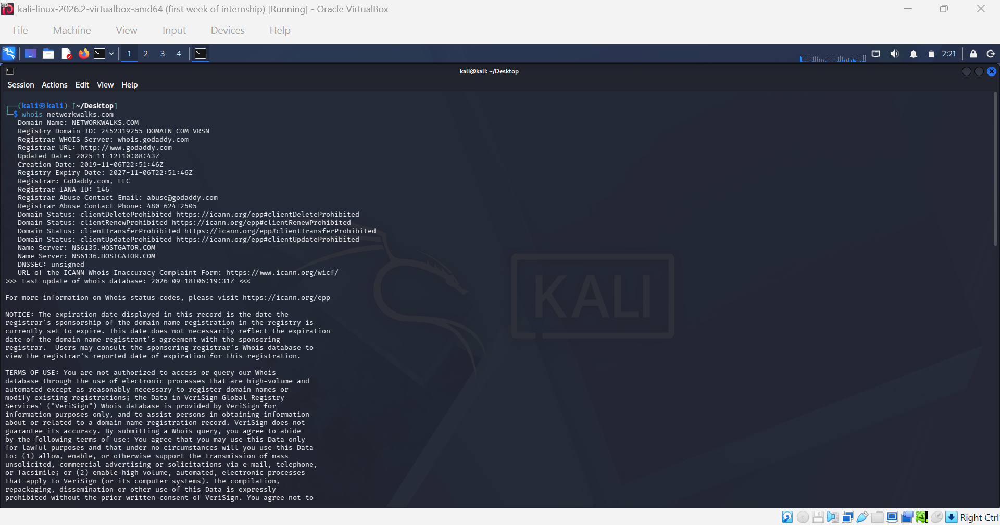
*whois networkwalks.com — registry section: registrar, registration timeline, status locks, HostGator name servers, unsigned DNSSEC.*


*whois networkwalks.com — registrar section confirming GoDaddy and repeating the registration/expiry dates.*


*whois networkwalks.com — registrant/tech contact block (Domains By Proxy) plus the full name server list.*


*whois networkwalks.com — terms of use section, including the notice that the WHOIS server is being retired in favour of RDAP.*

---

### Task 2 — `whatweb`: web technology fingerprinting

```bash
whatweb networkwalks.com
```

| Field | Value |
|---|---|
| Redirect chain | `http://` → **301** → `https://` → **200 OK** |
| Web server | Apache (version suppressed) |
| CMS | **WordPress 7.1.1** |
| Plugin | **WordPress Download Manager 3.3.58** |
| Front-end | Bootstrap, jQuery 3.7.1, HTML5, Google Tag Manager |
| Server IP / country | `192.232.216.135` — United States |
| Email exposed | `info@networkwalks.com` |
| Cookie | `__wpdm_client` — flagged `HttpOnly` |
| Uncommon headers | `x-nginx-cache`, `x-endurance-cache-level`, `x-redirect-by`, `permissions-policy` |

> **Attacker's view:** the most valuable command in the module, because it hands over *exact
> versions*. `WordPress 7.1.1` + `WP Download Manager 3.3.58` go straight into the NVD, Exploit-DB
> or the WPScan plugin database to check for a public exploit matching that precise build.
> Version-pinned recon turns a guessing game into a targeted one.

> ⚠️ **Deviation from the lab manual:** the course sheet recorded WordPress **7.0.4**; my run
> returned **7.1.1** — the site was patched in between. *Recon data has a shelf life; every
> finding needs a timestamp.*

📸 `fig2-whatweb.png`

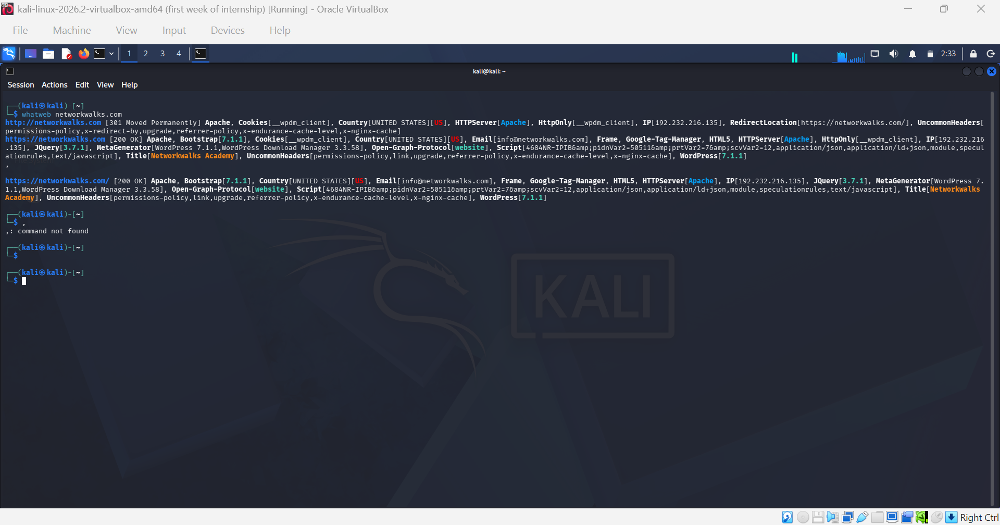
*whatweb networkwalks.com — redirect chain, Apache banner, WordPress 7.1.1 + WP Download Manager 3.3.58, origin IP, exposed email.*

---

### Task 3 — `nslookup`: DNS resolution

```bash
nslookup networkwalks.com
```

```
Server:         8.8.8.8
Address:        8.8.8.8#53

Non-authoritative answer:
Name:   networkwalks.com
Address: 192.232.216.135
```

> **Attacker's view:** converts a brand name into a routable target. With the IP, an attacker can
> scan the host directly, run a **reverse-IP lookup** to find every other site on the same box
> (shared hosting — a weaker neighbour can become the way in), and check historical DNS to see
> whether an origin server is hiding behind a CDN.

📸 `fig3-nslookup.png`

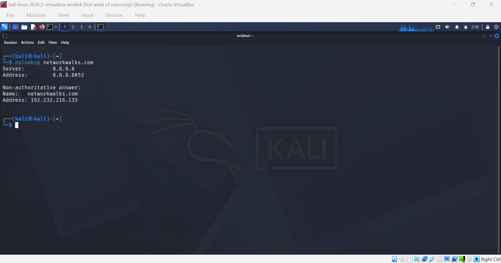
*nslookup networkwalks.com — resolved to 192.232.216.135 via Google Public DNS.*

---

### Task 4 — `curl -I`: HTTP response headers

```bash
curl -I https://networkwalks.com
```

```http
HTTP/2 200
link: <https://networkwalks.com/wp-json/>; rel="https://api.w.org/",
      <https://networkwalks.com/wp-json/wp/v2/pages/53>; rel="alternate"; type="application/json"
set-cookie: __wpdm_client=...; path=/; domain=networkwalks.com; secure; HttpOnly
referrer-policy: no-referrer-when-downgrade
x-endurance-cache-level: 0
x-nginx-cache: WordPress
content-type: text/html; charset=UTF-8
date: Fri, 18 Sep 2026 06:38:55 GMT
server: Apache
```

| Header | What it tells an assessor |
|---|---|
| `link: .../wp-json/` | **Biggest find** — confirms WordPress and exposes the REST API root |
| `server: Apache` | Software disclosed, version suppressed — partial hardening win |
| `set-cookie` | Correctly marked `secure` **and** `HttpOnly` |
| `x-nginx-cache` | An nginx caching layer fronts Apache — reverse-proxy architecture |
| *absent* | No `Strict-Transport-Security`, `Content-Security-Policy`, `X-Frame-Options`, `X-Content-Type-Options` |

> **Attacker's view:** the WordPress REST API is machine-readable and, depending on config, can
> enumerate users, posts and media. `/wp-json/wp/v2/users` is a routine first request for building
> a username list to feed into password attacks.

📸 `fig4-curl.png`

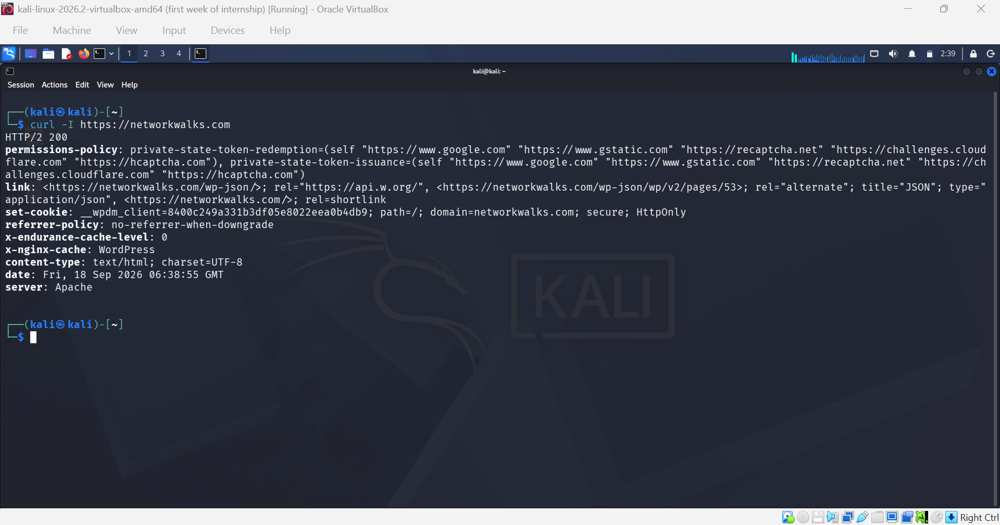
*curl -I https://networkwalks.com — HTTP/2 200, Apache banner, WordPress REST API endpoint, caching layer.*

---

### Task 5 — `wafw00f`: Web Application Firewall detection

```bash
wafw00f networkwalks.com
```

```
~ WAFW00F : v2.4.2 ~
[*] Checking https://networkwalks.com
[+] The site https://networkwalks.com is behind ModSecurity (SpiderLabs) WAF.
[~] Number of requests: 2
```

> **Attacker's view:** knowing a WAF is present changes the entire shape of an attack. ModSecurity
> will block **and log** naive SQLi/XSS/traversal payloads. An attacker who checks first slows down
> and adapts; one who doesn't trips the rules on their first probe and hands the defender a full
> record of the attempt.
>
> **Defender's view:** a strong positive — the WAF is deployed and actively responding.

> ⚠️ Unlike the other five tools here, `wafw00f` is **not purely passive** — it sent 2 crafted
> requests. Still in scope, but it's the one command the target could have logged.

📸 `fig5-wafw00f.png`

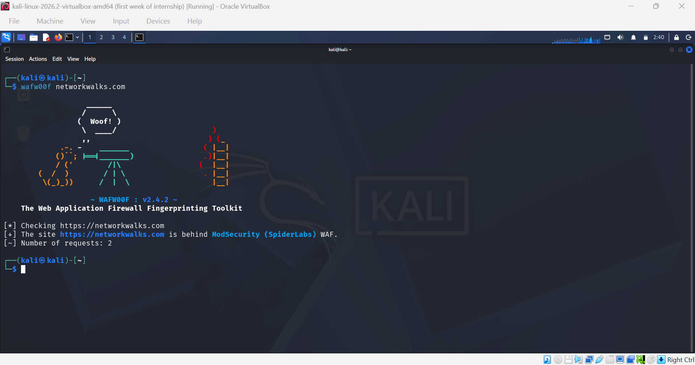
*wafw00f networkwalks.com — identifies ModSecurity (SpiderLabs) as the WAF protecting the site.*

---

### Task 6 — `dnsrecon`: full DNS enumeration

```bash
dnsrecon -d networkwalks.com
```

**8 records found:**

| Type | Record | Value / meaning |
|---|---|---|
| DNSSEC | — | ⚠️ No answer — zone **not signed** |
| SOA | `ns6135.hostgator.com` | `50.87.144.87` |
| NS | `ns6135.hostgator.com` | `50.87.144.87` — ⚠️ **recursion enabled** |
| NS | `ns6136.hostgator.com` | `192.232.216.131` — ⚠️ **recursion enabled** |
| MX | `mail.networkwalks.com` | `192.232.216.135` — same host as the website |
| A | `networkwalks.com` | `192.232.216.135` |
| TXT | google-site-verification | `rr04eRmqHoWY3XemnizDNVK4q75X-Ij-mjgEeg-UsYI` |
| TXT | SPF | `v=spf1 +a +mx +ip4:50.87.144.87 +include:websitewelcome.com ~all` |
| SRV ×8 | `_autodiscover._tcp` | `cpanelemaildiscovery.cpanel.net:443` → `184.94.203.9/.11/.14/.15`, `184.94.204.9/.11/.14/.15` |

**SPF analysis** — the policy terminates in `~all` (**soft fail**), which asks receiving servers
only to *mark* unauthorised mail as suspicious rather than reject it. A strict policy ends in
`-all`. No DMARC record appeared in the output.

> **Attacker's view:** this draws the whole map in one pass. The MX record shows mail and web share
> one IP (one compromise affects both). The SRV records give away that **cPanel** is the control
> panel, narrowing which login portals are worth probing. And **recursion enabled on both
> authoritative name servers** is the most substantive technical finding of the whole assessment —
> an open recursive resolver can be abused as a reflector in DNS amplification DDoS attacks and is
> more exposed to cache poisoning.

📸 `fig6-dnsrecon.png`

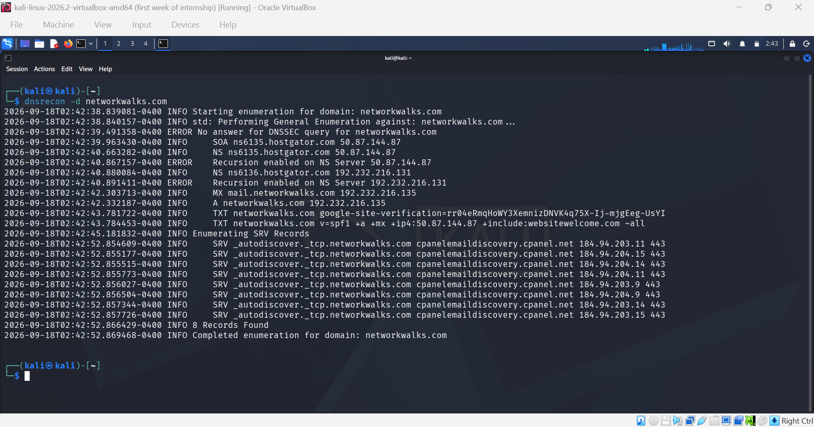
*dnsrecon -d networkwalks.com — full DNS footprint: SOA, both recursion-enabled NS, MX, SPF/TXT, and 8 cPanel autodiscover SRV records.*

---

## Module 2 — Footprinting with theHarvester (W2-PM4)

**Target:** `microsoft.com` · **Tool:** theHarvester 4.10.1 · **Tasks:** 2/2

theHarvester gathers emails, sub-domains, hosts, employee names and banners from public sources —
search engines, PGP key servers, certificate transparency logs, Shodan. Critically, it **never
contacts the target**: it queries third parties that have already indexed it, so the organisation
being profiled cannot see the activity in its own logs.

### Main switches

| Switch | Meaning |
|---|---|
| `-d DOMAIN` | Company name or domain to search |
| `-l LIMIT` | Limit the number of results (default 500) |
| `-b SOURCE` | Data source, or `all` for every source |
| `-f FILENAME` | Save results to XML and JSON |
| `-n` / `-c` | DNS server lookup / DNS brute force |
| `-s` | Use Shodan to query discovered hosts |

📸 `fig7-harvester.png`, `fig8-harvester-instruction.png`

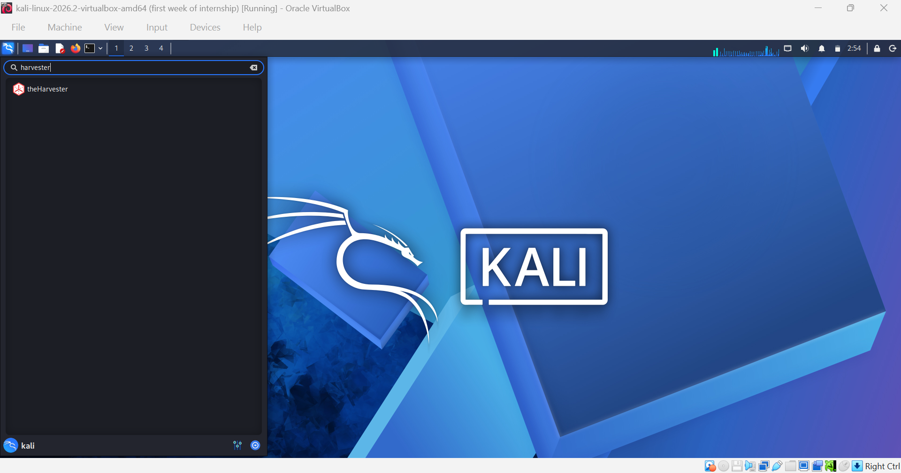
*Locating theHarvester in the Kali Linux application menu.*

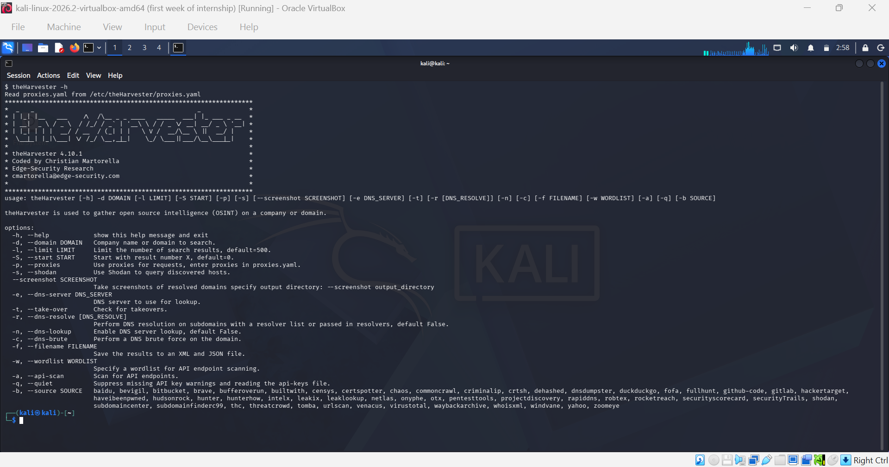
*theHarvester 4.10.1 usage instructions — available switches and the full list of supported OSINT data sources.*

---

### Task 1 — single source (Baidu)

```bash
theHarvester -d microsoft.com -l 1000 -b baidu
```

```
[*] Target: microsoft.com
[*] Searching Baidu.
[*] No IPs found.

[*] Emails found: 1
--------------------
viva-noreply@microsoft.com

[*] No people found.

[*] Hosts found: 5
------------------
account.microsoft.com
microsoftedge.microsoft.com
prod.support.services.microsoft.com
support.microsoft.com
windowsupdate.microsoft.com
```

| Category | Count | Detail |
|---|---|---|
| IP addresses | 0 | Baidu's index carries no IP data for this domain |
| **Emails** | **1** | `viva-noreply@microsoft.com` |
| People | 0 | None surfaced from this source |
| **Hosts / sub-domains** | **5** | account · microsoftedge · prod.support.services · support · windowsupdate |

> **Attacker's view:** five sub-domains and a working email address in seconds, with **zero contact
> with Microsoft**. Each sub-domain is a distinct attack surface that may run different software at
> a different patch level — `account.` is an auth surface, `support.` a content surface,
> `windowsupdate.` an update-distribution surface.
>
> More subtly, the harvested address reveals the **email naming convention** (`role-purpose@`).
> That lets an attacker generate plausible addresses for staff identified elsewhere, and register
> lookalike domains to impersonate a sender employees are already conditioned to ignore rather
> than scrutinise.

📸 `fig9-theharvester-baidu.png`

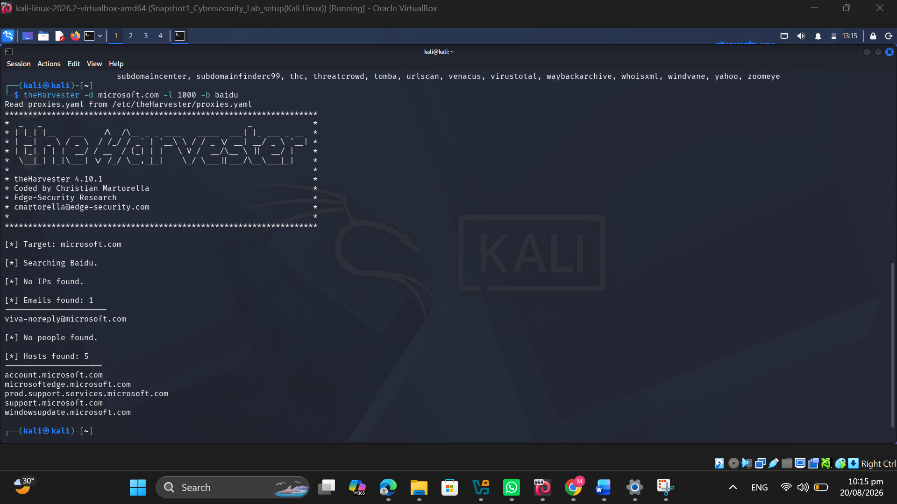
*theHarvester -d microsoft.com -l 1000 -b baidu — 1 email address and 5 sub-domains recovered from Baidu's index alone.*

---

### Task 2 — all sources

```bash
theHarvester -d microsoft.com -l 500 -b all
```

```
[*] Target: microsoft.com
Read api-keys.yaml from /etc/theHarvester/api-keys.yaml
[!] Missing API key for bevigil.
[!] Missing API key for Bitbucket.
[!] Missing API key for bufferoverun.
[!] Missing API key for BuiltWith.
[!] Missing API key for Brave Search.
[!] Missing API key for Censys ID and/or Secret.
[!] Missing API key for criminalip.
[!] Missing API key for Dehashed.
        ... (further sources skipped for the same reason)
```

**What actually happened, and why:**

| Source category | Status on default Kali | Examples |
|---|---|---|
| Anonymous search engines | ✅ Working | baidu, duckduckgo, yahoo |
| Certificate transparency | ✅ Usually working | crtsh, certspotter |
| Public archives | ✅ Usually working | waybackarchive, commoncrawl, rapiddns |
| Commercial threat-intel APIs | ⚠️ Skipped — key required | censys, shodan, bevigil, builtwith, criminalip, fullhunt, intelx, netlas, zoomeye |
| Breach-data platforms | ⚠️ Skipped — key required | dehashed, haveibeenpwned, leaklookup, hudsonrock |

Kali ships with an **empty** `/etc/theHarvester/api-keys.yaml`, so every source requiring
authentication is skipped. This is expected behaviour, not a broken install.

> ⚠️ **Deviation from the lab manual:** the sheet specified `-l 50`; I ran `-l 500`
> (theHarvester's own default). Method and conclusion are unchanged, but a report should state
> what was *actually executed*.

> **Attacker's view:** OSINT coverage is a function of the sources you can reach. A student on
> default Kali sees a handful of search results; a funded adversary with paid Censys, Shodan and
> breach-database subscriptions sees a vastly richer picture from the **same command**. Defenders
> should plan against the second scenario. And a single source is never enough — Baidu returned 5
> hosts, but certificate transparency logs typically return *hundreds*, because every TLS
> certificate ever issued for a sub-domain is publicly and permanently logged.

📸 `fig10_harvester-500.png`

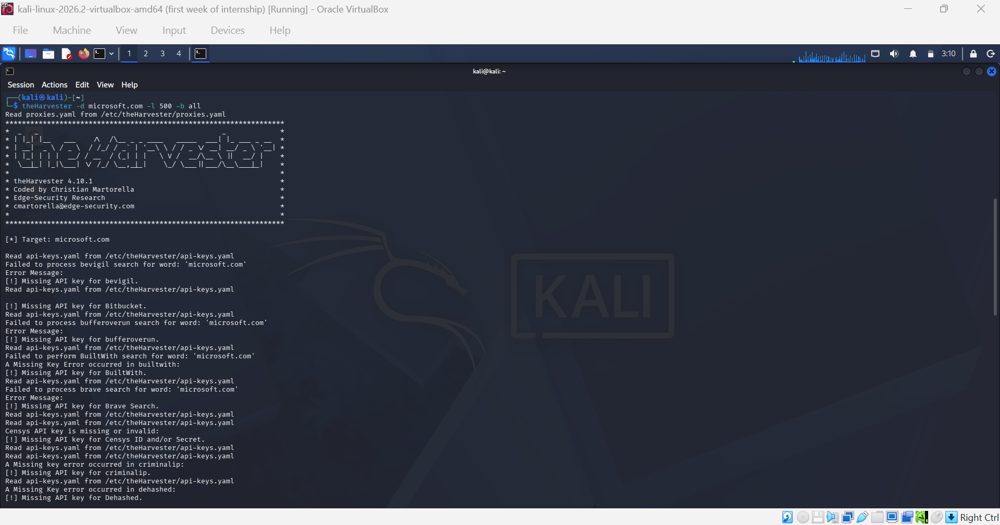
*theHarvester -d microsoft.com -l 500 -b all — iterating through every source; commercial platforms skipped for lack of an API key.*

---

## Module 3 — Network scanning with Zenmap (W2-PM5)

**Target:** my own local subnet · **Tool:** Zenmap / Nmap 7.991 · **Tasks:** 7/7

Where the previous two modules were passive, this one is **active** — packets are genuinely sent
and responses recorded. That is exactly why it was performed only against equipment I own.

### Task 1 — Install Zenmap

Downloaded from the official site, `https://nmap.org/download.html`. The installer bundles Npcap
(the packet-capture driver Nmap needs on Windows), the Zenmap GUI, Ndiff, Ncat and Nping.

> 🔐 **Only ever get Nmap from `nmap.org`.** Third-party "free download" mirrors are a known
> distribution channel for trojanised security tooling — and a backdoored scanner installed with
> admin rights and a packet driver is close to a worst case.

### Task 2 — Find the local IP and subnet

```powershell
ipconfig
```

| Adapter | IPv4 | Mask | Notes |
|---|---|---|---|
| Ethernet | — | — | Media disconnected |
| **Ethernet 2** (VirtualBox host-only) | `192.168.56.1` | 255.255.255.0 | No gateway — isolated virtual network |
| **Wi-Fi** | `192.168.1.6` | 255.255.255.0 | Gateway `192.168.1.1` — the real home LAN |

Two candidate subnets existed. I chose **`192.168.56.0/24`** — entirely virtual, created and owned
by my own machine, containing no third-party devices. The most conservative possible scope.

📸 `fig11-nmap.png`

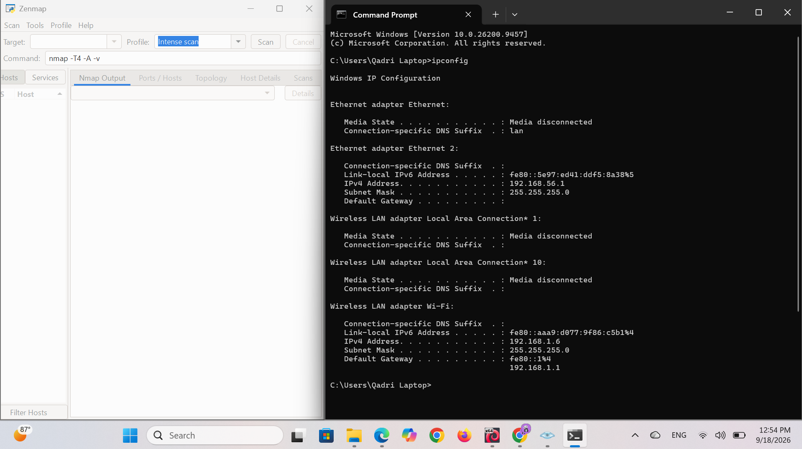
*ipconfig on the Windows host — VirtualBox host-only adapter (192.168.56.1/24) and Wi-Fi adapter (192.168.1.6/24), alongside Zenmap.*

### Task 3 — Discover live hosts

Target `192.168.56.0/24`, profile **Ping scan**:

```bash
nmap -sn 192.168.56.0/24
```

```
Starting Nmap 7.991 ( https://nmap.org ) at 2026-09-18 12:58 +0500
Nmap scan report for 192.168.56.1
Host is up.
Nmap done: 256 IP addresses (1 host up) scanned in 11.88 seconds
```

`-sn` means *host discovery only, skip the port scan* — the quietest and fastest way to find what
is alive, because it never connects to a service.

📸 `fig11(a)-nmap.png`, `fig11(b)-nmap.png`


*Zenmap configured with target 192.168.56.0/24 and the Ping scan profile — generates `nmap -sn 192.168.56.0/24`.*


*Scan complete — 256 addresses probed in 11.88 seconds, 192.168.56.1 confirmed up.*

### Tasks 4–6 — Host count, IPs, MACs

| Question | Answer |
|---|---|
| **Task 4.** How many hosts are live? | **1 host** out of 256 scanned |
| **Task 5.** What are their IP addresses? | `192.168.56.1` — the VirtualBox host-only adapter on my own machine |
| **Task 6.** What are their MAC addresses? | **Not reported.** See below. |

> ### 📋 Honest reporting of the MAC address result
>
> The lab manual's example returned 4 hosts with 4 MACs. My scan returned 1 host and no MAC.
> Rather than copying the manual's figures, here is why:
>
> Nmap can only report a MAC when it learns one from an **ARP reply**, which requires the host to
> be a *separate* device on the same layer-2 segment. Here the only responding address,
> `192.168.56.1`, is an interface on the **scanning machine itself** — Nmap doesn't ARP for its own
> interface. That's also why the output reads `Host is up.` with no latency figure.
>
> Additionally, no Kali guest VM was running at scan time, so `192.168.56.101` and other
> DHCP-assigned guest addresses were genuinely offline. **The result is correct for the
> conditions — it's simply a quiet network.**
>
> To get a richer result, `nmap -sn 192.168.1.0/24` against the Wi-Fi LAN would discover the
> router, phones, laptops and IoT devices, each with its MAC and vendor prefix resolved via ARP.
> The local machine's own MAC is always available via `ipconfig /all`.

### Task 7 — Topology

Opened **Topology** → enabled **Legend** → **Save Graphic** → **PDF**.

| Symbol | Meaning |
|---|---|
| ⚪ hollow circle | Host was not port scanned |
| 🟢 green | Fewer than 3 open ports |
| 🟡 yellow | 3–6 open ports |
| 🔴 red | More than 6 open ports — largest attack surface |
| ⬛ square | Router, switch or wireless access point |
| circle size | Grows with the number of open ports |
| line thickness | Thicker = higher round-trip time |

My topology shows two nodes: the black `localhost` node (the scanning machine) and a green node
for `192.168.56.1`, joined by a dashed line meaning *no traceroute information* — expected, since
both endpoints are the same machine. The node is green because it was ping-discovered and never
port scanned.

> **Attacker's view:** host discovery is the bridge between recon and attack. An attacker with a
> foothold on any internal machine runs exactly this command first, to see how far they can move
> laterally. In the topology view a red, heavily-connected node is the obvious first target — it
> tells the attacker where to spend effort without reading a single line of raw output. This is why
> unexplained devices on a corporate network matter: every entry point an inventory misses is one
> nobody is patching.

📸 `Screenshot 2026-09-18 130722.png`


*Zenmap Topology view with the legend panel open — localhost and the discovered host 192.168.56.1. Exported to PDF via Save Graphic.*

---

## Consolidated target profile

No single tool produces this picture — together they do. **That is the point of the exercise.**

### `networkwalks.com`

| Attribute | Value | Discovered by |
|---|---|---|
| Registrar | GoDaddy.com, LLC | whois |
| Registered / expires | Nov 2019 → Nov 2027 | whois |
| Registrant identity | Privacy-protected (Domains By Proxy) | whois |
| Hosting provider | HostGator (Endurance / websitewelcome.com) | whois, dnsrecon, SPF |
| Control panel | cPanel | dnsrecon (SRV autodiscover) |
| Origin IP | `192.232.216.135` | nslookup, whatweb, dnsrecon |
| Name servers | ns6135 / ns6136.hostgator.com | whois, dnsrecon |
| Mail server | `mail.networkwalks.com` → same IP as web | dnsrecon |
| Web server | Apache, fronted by nginx cache | whatweb, curl |
| CMS / plugin | WordPress 7.1.1 · WP Download Manager 3.3.58 | whatweb |
| Exposed endpoint | `/wp-json/` REST API | curl |
| Contact email | `info@networkwalks.com` | whatweb |
| Security controls ✅ | ModSecurity WAF · HTTPS 301 · HttpOnly+secure cookie · registrar locks | wafw00f, whatweb, curl, whois |
| Weak points ⚠️ | DNSSEC unsigned · NS recursion enabled · SPF `~all` · versions advertised · no HSTS/CSP | dnsrecon, whatweb, curl |

### `microsoft.com` (passive OSINT only)

| Attribute | Value |
|---|---|
| Email | `viva-noreply@microsoft.com` |
| Naming convention | `role-purpose@microsoft.com` |
| Sub-domains | account · microsoftedge · prod.support.services · support · windowsupdate |

### Local network

| Attribute | Value |
|---|---|
| Subnets present | `192.168.56.0/24` (host-only), `192.168.1.0/24` (Wi-Fi LAN) |
| Subnet scanned | `192.168.56.0/24` — 256 addresses |
| Live hosts | 1 — `192.168.56.1` |
| Scan duration | 11.88 seconds |

---

## Key findings

> ⚠️ **These are observations, not confirmed vulnerabilities.** No exploitation or validation was
> performed. The presence of a software version, IP address or DNS record does not by itself mean
> a system is exploitable. Risk levels reflect how much each finding would *assist* an attacker.

| # | Finding | Evidence | Risk |
|---|---|---|---|
| 1 | DNS recursion enabled on both authoritative NS | dnsrecon — `50.87.144.87`, `192.232.216.131` | 🟠 Medium |
| 2 | CMS & plugin versions publicly advertised | whatweb — WordPress 7.1.1, WPDM 3.3.58 | 🟠 Medium |
| 3 | DNS infrastructure fully enumerable; zone unsigned | dnsrecon — 8 records, no DNSSEC | 🟠 Medium |
| 4 | SPF policy ends in a soft fail | TXT — `v=spf1 ... ~all` | 🟠 Medium |
| 5 | WordPress REST API endpoint exposed | curl — `link:` header `/wp-json/` | 🟠 Medium |
| 6 | Corporate emails publicly harvestable | whatweb + theHarvester | 🟠 Medium |
| 7 | Origin server IP identifiable | nslookup, whatweb, dnsrecon | 🟢 Low |
| 8 | Mail and web on the same address | MX = A = `192.232.216.135` | 🟢 Low |
| 9 | Security response headers absent | curl — no HSTS / CSP / XFO / XCTO | 🟢 Low |
| 10 | WAF technology identifiable | wafw00f — ModSecurity (SpiderLabs) | 🟢 Low |
| 11 | Sub-domains enumerable from public indexes | theHarvester — 5 hosts from Baidu alone | 🟢 Low |
| 12 | Local host discovery is trivial | 256 addresses swept in 11.88s | 🟢 Low |

### ✅ Positive findings

A balanced report records what works, not just what doesn't:

- **ModSecurity WAF deployed** and actively responding
- **HTTPS enforced** via permanent 301 redirect
- **Session cookie hardened** with both `secure` and `HttpOnly`
- **Registrar transfer locks enabled** — all four `clientXxxProhibited` flags set
- **WHOIS privacy protection active** — no real registrant name, address or email exposed
- **Apache version suppressed** in the server banner
- **SPF record published** — imperfect terminator, but present and correctly scoped

---

## Recommendations

| # | Recommendation | Addresses |
|---|---|---|
| 1 | **Disable recursion on the authoritative name servers.** Highest-value change in this report — raise with the hosting provider. | 1, 3 |
| 2 | **Sign the zone with DNSSEC** so validating resolvers can detect forged answers. | 3 |
| 3 | **Tighten SPF to `-all`** once legitimate senders are verified, and **add DMARC** (`p=none` → `quarantine` → `reject`). | 4 |
| 4 | **Suppress version disclosure** — remove the WordPress generator tag and plugin version strings. Forces an attacker to probe, and probing is noisy. | 2 |
| 5 | **Keep the CMS and plugins patched.** Obscurity is cosmetic; patching is the actual control. | 2 |
| 6 | **Restrict the WordPress REST API** — disable user-enumeration endpoints or require auth. | 5 |
| 7 | **Add missing security headers** — HSTS, CSP, `X-Content-Type-Options: nosniff`, `X-Frame-Options`. | 9 |
| 8 | **Protect published emails and train staff** — contact forms over plain-text addresses; phishing awareness on the basis that harvested addresses *will* be targeted. | 6 |
| 9 | **Consider separating mail from web hosting** — one IP means one compromise takes out both. | 8 |
| 10 | **Keep the WAF enabled, tuned and monitored.** A WAF nobody reads the logs of is a speed bump, not a control. | 10 |
| 11 | **Run self-reconnaissance on a schedule** — see what an attacker sees, then reduce it deliberately. | all |
| 12 | **Inventory sub-domains continuously** via certificate transparency monitoring; decommission forgotten hosts. | 11 |
| 13 | **Perform regular internal network discovery** and investigate any unexpected device. | 12 |
| 14 | **Maintain network documentation** so "unknown device" is a meaningful alert. | 12 |
| 15 | **Only ever test with authorisation.** Every technique here is legal with permission and criminal without it. | — |

---

## Lessons learned

| Challenge | What it taught me |
|---|---|
| theHarvester skipped most sources with "Missing API key" | Not a broken install — most modern sources are commercial platforms and Kali ships an empty `api-keys.yaml`. **OSINT coverage is bounded by the sources you can reach**, and a funded adversary sees far more from the same command than a student does. |
| Zenmap found only 1 host and no MAC | I investigated instead of copying the manual's figures. The only responder was an interface on the scanning machine, so no ARP exchange occurred. **A report must state what actually happened, and explain it. Copying an expected result is fabricating evidence.** |
| whatweb showed 7.1.1, manual said 7.0.4 | The site was patched in between. **Recon findings are perishable** — every finding needs a timestamp, and old recon must be re-validated before it's acted on. |
| WHOIS warned of retirement in favour of RDAP | The tooling landscape shifts underneath you. **Track protocol changes, don't just memorise commands.** |
| Choosing a legitimate scan target | Two subnets were available; I chose the isolated virtual one over shared home Wi-Fi, accepting a less impressive result. **Scope discipline comes before interesting output.** |
| Turning raw output into a finding | The hard part wasn't running the commands — it was *reading* them. `Recursion enabled` is one unremarkable line among forty, yet it's the most significant finding here. **The value a security professional adds is in interpretation, not execution.** |

---

## Command cheat sheet

### Executed in this assessment

```bash
# --- W2-PM1 : Footprinting with multiple Kali tools -----------------
whois networkwalks.com                    # domain registration record
whatweb networkwalks.com                  # web technology fingerprint
nslookup networkwalks.com                 # resolve domain → IPv4
curl -I https://networkwalks.com          # HTTP response headers only
wafw00f networkwalks.com                  # WAF detection & fingerprinting
dnsrecon -d networkwalks.com              # full DNS record enumeration

# --- W2-PM4 : theHarvester OSINT -----------------------------------
theHarvester -d microsoft.com -l 1000 -b baidu   # single source
theHarvester -d microsoft.com -l 500  -b all     # every source

# --- W2-PM5 : Zenmap / Nmap ----------------------------------------
ipconfig                                  # local IPs & subnets (Windows)
ipconfig /all                             # includes local MAC address
nmap -sn 192.168.56.0/24                  # ping sweep / host discovery
```

### Useful follow-ups (not executed here)

```bash
whatweb -v -a 3 networkwalks.com                      # aggressive, verbose fingerprinting
dnsrecon -d networkwalks.com -t brt -D wordlist.txt   # sub-domain brute force
theHarvester -d target.com -b crtsh -f out            # cert transparency → XML/JSON
nmap -sn 192.168.1.0/24                               # LAN sweep with MAC + vendor
dig networkwalks.com ANY +noall +answer               # alternative DNS query path
```

---

## Reproducing this work

```bash
# 1. Install the tools (already present on Kali Linux)
sudo apt update && sudo apt install -y whois whatweb dnsutils curl wafw00f dnsrecon theharvester

# 2. Run the footprinting sequence against a target YOU are authorised to test
whois        <your-authorised-domain>
whatweb      <your-authorised-domain>
nslookup     <your-authorised-domain>
curl -I  https://<your-authorised-domain>
wafw00f      <your-authorised-domain>
dnsrecon -d  <your-authorised-domain>

# 3. Save every output for your report
whois <your-authorised-domain> | tee outputs/01_whois.txt

# 4. Network scanning — only on a network YOU own
ipconfig            # Windows   → find your subnet
ip a                # Linux
nmap -sn <your-own-subnet>/24
```

> Take a **VM snapshot before you start** so the lab can be rolled back and repeated.
> Your results will differ from mine — targets change, and that's the point.

---

## Legal & ethical notice

> **These materials are for education and research purposes only.**
>
> All activity documented here was performed either **passively against public third-party data
> sources**, against a target where the training program **holds written permission**
> (`networkwalks.com`), or against **equipment I own personally**. No packet was ever sent to a
> Microsoft-owned system. No exploitation, vulnerability validation, password attack, denial of
> service, social-engineering campaign or WAF-bypass attempt was performed.
>
> **Reconnaissance and scanning are only legal when:**
> - You test a device or network **you own**, or your own lab environment
> - You hold **written, documented permission** from the owner
> - You are working as a security professional under a **signed agreement with an agreed scope**
>
> **Everything outside these three cases is illegal.** Misuse can lead to criminal charges, heavy
> fines, loss of employment and a permanent record. In most countries unauthorised access is a
> crime **even when nothing is damaged**. The instructor, the authors and Networkwalks are not
> responsible for what anyone does with this knowledge — every action you take is your own
> responsibility.

---

## Author

**Muhammad Talha**
Cybersecurity Intern — B083

[](https://www.linkedin.com/in/talha2715/)
[](https://github.com/Talha30844)

| | |
|---|---|
| **Program** | Cybersecurity & Ethical Hacking Program — Networkwalks |
| **Week** | 02 |
| **Deliverable** | W2-PM-FINAL |
| **Modules covered** | W2-PM1 · W2-PM4 · W2-PM5 |
| **Date** | 18 September 2026 |

📄 **Full report:** [**W2-PM-FINAL_Penetration_Testing_Report.pdf**](./W2-PM-FINAL_Penetration_Testing_Report.pdf) — click to download

---

<sub>Built as part of the Networkwalks Cybersecurity & Ethical Hacking Internship. For educational purposes only.</sub>
